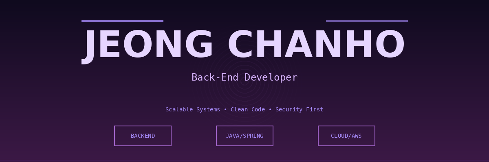

# JEONG CHANHO

<div align="center">

### 💻 Back-End Developer | Problem Solver

```
🚀 Crafting Scalable Backend Solutions
```

</div>

---

## 👋 About Me

Backend engineer with a passion for building **scalable, secure, and efficient systems**. Specialized in Spring Boot architecture and modern backend patterns. I believe in writing clean, maintainable code that solves real-world problems.

**Location:** Seoul, Korea | **Focus:** Enterprise Backend Development

---

## 🎯 Core Competencies

<div align="center">

### Backend Framework


### API & Authentication


### Database & Cache


### ORM & Data


### Infrastructure


### Additional Skills


</div>

---

## 📊 GitHub Analytics

<div align="center">


</div>

---

## 🛠️ Technical Expertise

| Category | Details |
|----------|---------|
| **Backend Architecture** | Spring Boot, Spring Security, Microservices |
| **Authentication** | OAuth2.0, JWT, Auth0, Session Management |
| **Data Persistence** | JPA, MyBatis, Spring Data, Transaction Management |
| **Cloud Services** | AWS EC2, AWS S3, AWS RDS |
| **DevOps** | Docker, Docker Compose, Nginx, CI/CD |
| **API Development** | RESTful API, JSON, FastAPI, API Documentation |
| **Performance** | Redis Caching, Database Optimization, Query Performance |
| **Security** | SQL Injection Prevention, XSS Protection, CORS |

---

## 💡 Development Philosophy

> **"Write code that is not just functional, but maintainable, scalable, and secure."**

### My Principles
- 🎯 **Goal-Oriented**: Clear understanding of business requirements
- 🔒 **Security First**: Security is built-in, not bolted-on
- ⚡ **Performance Conscious**: Optimized for speed and efficiency
- 📚 **Continuous Learning**: Staying updated with latest technologies
- 🤝 **Team Collaboration**: Clear communication and knowledge sharing
- 📖 **Code Quality**: Clean code, proper documentation, and best practices

---

## 📈 Key Metrics

```
Languages: Java, Python, JavaScript
Databases: MySQL, PostgreSQL, MariaDB
Cloud Platform: AWS (EC2, S3, RDS)
Years of Experience: Problem-solving & Backend Development
Contribution: Open to collaboration and knowledge sharing
```

---

## 🔗 Connect With Me

<div align="center">

[](mailto:jh940412@gmail.com)
[](https://notion.so)
[](https://github.com/chanho8629-lgtm)

</div>

---

<div align="center">

### 🚀 Let's Build Something Amazing Together!

Feel free to reach out for discussions, collaborations, or just to say hello.

**Made with 💜 by JEONG CHANHO**

---

*Last Updated: 2026* | *Profile Version 1.0*

</div>
